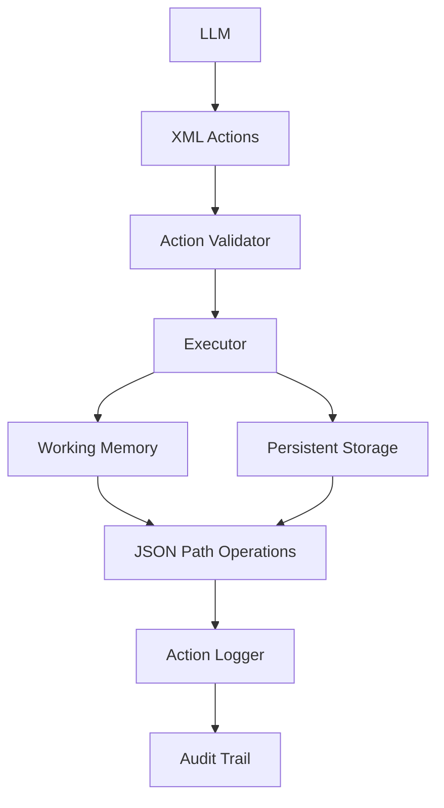

# 🤖 lkjagent

**lkjagent** is a sophisticated AI Agent framework specifically designed for small Language Learning Models (LLMs). It solves the critical challenge of memory limitations in smaller models by implementing a dual-memory architecture that enables complex, persistent, and long-running task execution.

## 🌟 Key Features

- **🧠 Dual Memory Architecture**: Finite working memory (RAM) + infinite persistent storage
- **📡 XML-Based Communication**: Structured action protocol for reliable LLM interaction
- **⚡ Modular TypeScript Design**: Clean, maintainable, and scalable architecture
- **🔄 Persistent Task Management**: Long-running tasks with state preservation across sessions
- **📊 Comprehensive Action Logging**: Full audit trail of all agent operations
- **🛡️ Robust Error Handling**: Graceful failure recovery with detailed error reporting
- **🎯 Action Numbering System**: Sequential tracking of all operations in `/result_data/action_N/`
- **🔍 Advanced XML Processing**: Safe XML parsing with circular reference detection and validation

## 📋 Table of Contents

- [🌟 Key Features](#-key-features)
- [📋 Table of Contents](#-table-of-contents)
- [🚀 Quick Start](#-quick-start)
- [🏗️ Architecture Overview](#️-architecture-overview)
- [🔧 Installation](#-installation)
- [⚙️ Configuration](#️-configuration)
- [🧩 Modular Utilities](#-modular-utilities)
- [🛠️ Tool System](#️-tool-system)
- [📊 Data Management](#-data-management)
- [💻 Usage Examples](#-usage-examples)
- [🔄 Development Workflow](#-development-workflow)
- [📁 Project Structure](#-project-structure)
- [🎮 Example Use Cases](#-example-use-cases)
- [📚 API Reference](#-api-reference)
- [🤝 Contributing](#-contributing)
- [📄 License](#-license)

## 🚀 Quick Start

```bash
# 1. Clone and setup
git clone <repository-url>
cd lkjagent
npm install

# 2. Build the project
npm run build
# or for development
npx tsc

# 3. Initialize data files
npm run init-data

# 4. Start the agent
npm start
```

## 🏗️ Architecture Overview

### Memory System

lkjagent implements a sophisticated dual-memory architecture inspired by human cognitive systems, specifically designed to overcome the memory limitations of smaller LLMs:



#### 🧠 Working Memory (RAM)
- **Finite capacity** (configurable, default: 2048 characters)
- **Fast access** for current task context and immediate operations
- **Structured data** with predefined schemas and type safety
- **Automatic cleanup** when limits are reached to maintain performance
- **Real-time state** for active tasks and system operations

#### 💾 Persistent Storage
- **Infinite capacity** for long-term data retention and archival
- **Hierarchical organization** with Unix-style path-based access (`/path/to/data`)
- **Advanced search capabilities** across all stored content with keyword matching
- **Versioning system** for tracking data evolution over time
- **Cross-session persistence** maintaining state between agent restarts

### 📡 Communication Protocol

The agent uses a robust XML-based protocol for structured LLM communication:

```xml
<actions>
  <action>
    <kind>memory_set</kind>
    <target_path>/user/todo/new_task</target_path>
    <content>{"task_description": "Complete project documentation", "status": "pending", "priority": "high"}</content>
  </action>
  <action>
    <kind>storage_ls</kind>
    <target_path>/archived_data</target_path>
  </action>
</actions>
```

**XML Features:**
- **Schema Validation**: Ensures proper action structure and prevents malformed requests
- **Content Escaping**: Safe handling of special characters and nested data
- **Error Recovery**: Graceful parsing with detailed error messages
- **Circular Reference Detection**: Prevents infinite loops in complex data structures

## 🔧 Installation

### 📦 Prerequisites

- **Node.js 16+** and npm/yarn
- **TypeScript 4.5+** for development
- **LM Studio** or compatible local LLM server (Ollama, etc.)
- **4GB+ RAM** recommended for optimal performance

### 🛠️ Installation Steps

```bash
# Clone the repository
git clone https://github.com/your-username/lkjagent.git
cd lkjagent

# Install dependencies
npm install

# Build the TypeScript project
npm run build
# Alternative: npx tsc

# Initialize data files (creates default JSON files)
npm run init-data
```

### 📁 Data Directory Setup

The following files will be created in the `data/` directory:

```bash
data/
├── config.json      # Agent configuration
├── memory.json      # Working memory state
├── storage.json     # Persistent storage
└── log.json         # Action execution log
```

**Manual Setup (if npm scripts are unavailable):**

```bash
# Create data directory and files
mkdir -p data

# Create configuration file
echo '{"memory":{"MemoryCharacterMax":2048,"DirectChildMax":8}}' > data/config.json

# Create empty data files
echo '{"user":{"todo":{}},"sys":{"result_data":{}}}' > data/memory.json
echo '{"knowledge_base":{"system_policy_summary":"","greeting_message":""},"archived_data":{}}' > data/storage.json
echo '[]' > data/log.json
```

## ⚙️ Configuration

### 🔧 Configuration Options

Configure lkjagent through `data/config.json`:

```json
{
  "memory": {
    "MemoryCharacterMax": 4096,
    "DirectChildMax": 12
  },
  "llm": {
    "apiUrl": "http://localhost:1234/v1/chat/completions",
    "model": "llama-3.2-3b-instruct",
    "maxTokens": 1000,
    "temperature": 0.7
  },
  "system": {
    "maxLogEntries": 1000,
    "autoCleanup": true,
    "debugMode": false
  }
}
```

#### Memory Configuration
- **`MemoryCharacterMax`**: Maximum characters in working memory (default: 2048)
- **`DirectChildMax`**: Maximum direct children per memory directory (default: 8)

#### LLM Configuration  
- **`apiUrl`**: LM Studio API endpoint (default: http://localhost:1234/v1/chat/completions)
- **`model`**: Model name to use for inference
- **`maxTokens`**: Maximum tokens per LLM response
- **`temperature`**: Creativity/randomness setting (0.0-1.0)

#### System Configuration
- **`maxLogEntries`**: Maximum entries in action log before cleanup
- **`autoCleanup`**: Enable automatic cleanup of old data
- **`debugMode`**: Enable verbose logging for debugging

### 🎯 Action Numbering System

lkjagent features an advanced action numbering system that tracks all operations sequentially:

```json
{
  "sys": {
    "result_data": {
      "action_1": {
        "action_number": 1,
        "timestamp": 1672531200000,
        "action": "storage_ls",
        "target_path": "/",
        "status": "success",
        "data": {"the_unending_chronicle": {...}}
      },
      "action_2": {
        "action_number": 2, 
        "timestamp": 1672531201000,
        "action": "memory_set",
        "target_path": "/user/current_task",
        "status": "success"
      }
    }
  }
}
```

**Benefits:**
- **Sequential Tracking**: Every action gets a unique sequential number
- **Error Isolation**: Failed actions are logged with detailed error information
- **Debugging Support**: Easy to trace execution flow and identify issues
- **State Recovery**: Can replay or recover from specific action points

## 🧩 Modular Utilities

lkjagent features a clean, modular architecture with distributed utility functions that provide maximum maintainability and flexibility:

### 🏗️ Architecture Benefits

#### 🔧 Development Benefits
- **Clear Separation**: Each module has a single, well-defined responsibility
- **Easy Testing**: Individual utilities can be unit tested in isolation  
- **Maintainable Code**: Bugs and features can be isolated to specific modules
- **Type Safety**: Full TypeScript support prevents runtime errors
- **Hot Reload**: Individual modules can be updated without full system restart

#### ⚡ Operational Benefits
- **Reduced Complexity**: Main entry point is minimal and easy to understand
- **Error Isolation**: Failures in one utility don't cascade to others
- **Performance**: Lazy loading and optimized execution paths
- **Debugging**: Clear module boundaries simplify troubleshooting
- **Scalability**: Easy to add new utilities without affecting existing ones

### 🔧 Core Utilities (`src/util/`)

#### 🔄 Agent Loop (`agent-loop.ts`)
The heart of lkjagent - orchestrates the continuous execution cycle:

```typescript
import { runAgent, resetIterationCounter } from './util/agent-loop';

// Start the continuous agent execution loop
await runAgent();

// For testing: reset iteration counter
resetIterationCounter();
```

**Key Features:**
- **🔄 Continuous Operation**: Infinite loop for persistent agent execution
- **🛡️ Error Recovery**: Graceful error handling with detailed logging and continuation
- **📊 Iteration Tracking**: Sequential numbering of iterations with error isolation
- **🎯 Modular Integration**: Coordinates all utility components seamlessly

#### ✅ Action Validation (`action-validator.ts`)
Comprehensive validation system ensuring action integrity:

```typescript
import { validateAction, isValidAction } from './util/action-validator';

const action = { kind: 'memory_set', target_path: '/user/task', content: 'data' };
const errors = validateAction(action);

if (errors.length === 0) {
  console.log('✅ Action is valid');
  await executeAction(action);
} else {
  console.log('❌ Validation errors:', errors);
}
```

**Validation Features:**
- **🔍 Pre-execution Validation**: Prevents invalid actions from executing
- **📝 Detailed Error Reporting**: Specific validation error messages with context
- **🛡️ Type Safety**: TypeScript-based validation rules with compile-time checks
- **⚡ Fast Validation**: Optimized validation logic for minimal performance impact

#### ⚙️ Action Execution (`executor.ts`)
Centralized action execution engine with comprehensive error handling:

```typescript
import { executeAction, resetActionCounter } from './util/executor';

await executeAction({
  kind: 'memory_set',
  target_path: '/user/task',
  content: { description: 'Complete documentation', status: 'pending' }
});

// For testing: reset action counter
resetActionCounter();
```

**Execution Features:**
- **🎯 Unified Execution**: Single point for all action processing with consistent behavior
- **📊 Automatic Logging**: All actions logged with timestamps, status, and sequential numbering
- **🛡️ Error Recovery**: Graceful failure handling with detailed error reporting in result_data
- **🔄 Continuation**: System continues operation even after individual action failures

#### 🤖 LLM Communication (`llm.ts`)
Streamlined interface for Large Language Model interaction:

```typescript
import { callLLM } from './util/llm';

const systemPrompt = await generateSystemPrompt();
const response = await callLLM(systemPrompt);
const actions = parseActionsFromXml(response);
```

**Communication Features:**
- **🔌 LM Studio Integration**: Direct connection to local LLM servers with automatic API handling
- **✅ Response Validation**: Ensures XML format compliance with fallback handling
- **🛡️ Fallback Handling**: Graceful degradation on communication errors
- **📡 Retry Logic**: Automatic retry on temporary connection failures

#### 📝 System Prompt Generation (`prompt.ts`)
Dynamic system prompt creation with comprehensive state inclusion:

```typescript
import { generateSystemPrompt } from './util/prompt';

const prompt = await generateSystemPrompt();
console.log('Generated prompt with current memory and storage state');
```

**Prompt Features:**
- **🔄 Dynamic State Injection**: Includes current memory and storage state in real-time
- **⚙️ Configuration Integration**: Respects memory limits and system constraints
- **📄 XML Format Specification**: Ensures proper LLM response format expectations
- **🎯 Context Optimization**: Balances information completeness with token efficiency

#### 🔄 XML Processing (`xml.ts`)
Advanced XML parsing and generation with robust error handling:

```typescript
import { parseActionsFromXml, jsonToXml, XmlError } from './util/xml';

try {
  const actions = parseActionsFromXml(llmResponse);
  const xmlString = jsonToXml(dataObject, 'root');
} catch (error) {
  if (error instanceof XmlError) {
    console.log('XML Error:', error.message, 'Context:', error.context);
  }
}
```

**XML Features:**
- **🔄 Bidirectional Conversion**: JSON to XML and XML to action parsing with full fidelity
- **🔍 Content Processing**: Handles nested XML structures in action content safely
- **🛡️ Error Resilience**: Graceful handling of malformed XML with detailed error context
- **🔒 Security**: XML injection prevention and content escaping
- **🌀 Circular Reference Detection**: Prevents infinite loops in complex data structures

#### 📁 JSON Path Operations (`json.ts`)
Powerful Unix-style path operations for nested data manipulation:

```typescript
import { 
  getValueAtPath, 
  setValueAtPath, 
  updateObjectAtPath,
  validatePath 
} from './util/json';

// Unix-style path operations
const value = getValueAtPath(data, '/user/todo/task1');
setValueAtPath(data, '/user/new_task', { status: 'pending' });
updateObjectAtPath(data, '/user/settings', { theme: 'dark' });

// Path validation
validatePath('/valid/path'); // throws error if invalid
```

**Path Features:**
- **🛤️ Unix-style Paths**: Intuitive `/path/to/data` notation for easy navigation
- **🛡️ Safe Operations**: Automatic intermediate object creation and null safety
- **🔄 Merge Support**: Non-destructive object updates with deep merging
- **✅ Path Validation**: Comprehensive validation of path formats and structure
- **⚡ Performance**: Optimized for frequent path operations

## 🛠️ Tool System

Individual tool implementations with focused functionality:

#### Memory Operations
- **`memory_set.ts`**: Add/update data in working memory
- **`memory_remove.ts`**: Delete data from working memory  
- **`memory_mv.ts`**: Move data between memory locations

#### Storage Operations
- **`storage_set.ts`**: Move data from memory to persistent storage
- **`storage_get.ts`**: Load data from storage to memory
- **`storage_remove.ts`**: Delete data from persistent storage
- **`storage_search.ts`**: Search storage content by keywords
- **`storage_ls.ts`**: List storage directory contents

#### Action Logging
- **`action_logger.ts`**: Comprehensive operation tracking and audit trail

### Configuration Options

- **MemoryCharacterMax**: Maximum characters in working memory
- **DirectChildMax**: Maximum direct children per memory directory

## Tool System

### Available Actions

| Action | Description | Parameters | Example |
|--------|-------------|------------|---------|
| `memory_set` | Add/update memory data | `target_path`, `content` | Set current task |
| `memory_remove` | Delete memory data | `target_path` | Remove completed task |
| `memory_mv` | Move memory data | `source_path`, `target_path` | Reorganize data |
| `storage_set` | Save to persistent storage | `source_path`, `target_path` | Archive completed work |
| `storage_get` | Load from storage | `target_path` | Retrieve archived data |
| `storage_remove` | Delete from storage | `target_path` | Clean up old data |
| `storage_search` | Search storage content | `content` | Find relevant information |
| `storage_ls` | List storage directory | `target_path` | Browse storage structure |

### Action Execution Flow

1. **Validation**: Action validation using `action-validator.ts`
2. **Execution**: Performed by `executor.ts` with comprehensive error handling
3. **Logging**: Automatic logging via `action_logger.ts`
4. **Error Recovery**: Graceful failure handling with detailed error messages

### Modular Design Benefits

- **Separation of Concerns**: Each utility handles a specific responsibility
- **Maintainability**: Clear module boundaries for easy debugging and updates
- **Testability**: Individual modules can be unit tested in isolation
- **Reusability**: Utility functions can be used across different components
- **Type Safety**: Full TypeScript support with comprehensive interfaces

## Data Management

### Memory Structure (`data/memory.json`)

```json
{
  "user": {
    "todo": {
      "task1": {
        "task_description": "Complete documentation",
        "status": "pending",
        "details": "Write comprehensive README"
      }
    },
    "current_task": {
      "id": "task1",
      "description": "Documentation task",
      "status": "in_progress"
    }
  },
  "sys": {
    "result_data": null
  }
}
```

### Storage Structure (`data/storage.json`)

```json
{
  "knowledge_base": {
    "system_policy_summary": "Agent operational guidelines",
    "greeting_message": "Hello! I'm lkjagent."
  },
  "archived_data": {
    "completed_tasks": {},
    "project_history": {}
  }
}
```

### Action Log Structure (`data/log.json`)

```json
[
  {
    "timestamp": 1672531200000,
    "actionType": "memory_set",
    "target_path": "/user/todo/task1",
    "content": "Task description",
    "status": "success"
  }
]
```

## Usage

### Basic Operation

```bash
# Start the agent
npm start

# Or run directly with Node.js
node dist/index.js
```

### Integration with LM Studio

1. **Start LM Studio** with your preferred small LLM
2. **Configure API endpoint** in the agent code
3. **Run lkjagent** - it will automatically connect and begin operation

### Example Workflow

1. Agent receives user input
2. Generates system prompt with current memory state
3. Sends prompt to LLM via API
4. Parses XML response into actions
5. Executes each action sequentially
6. Logs all operations
7. Repeats the cycle

## Development

### Building

```bash
# Development build with watch
npx tsc --watch

# Production build
npx tsc
```

### Testing

```bash
# Run tests (when available)
npm test

# Type checking
npx tsc --noEmit
```

### Code Structure

The project follows a modular TypeScript architecture with distributed utilities:

- **`src/index.ts`**: Minimal entry point that delegates to utility modules
- **`src/util/`**: Core utility functions organized by functionality
  - **`agent-loop.ts`**: Main agent execution loop
  - **`action-validator.ts`**: Action validation logic
  - **`executor.ts`**: Centralized action execution
  - **`llm.ts`**: LLM communication interface
  - **`prompt.ts`**: System prompt generation
  - **`xml.ts`**: XML processing utilities
  - **`json.ts`**: JSON path manipulation utilities
- **`src/types/`**: TypeScript interfaces and type definitions
- **`src/config/`**: Configuration management system
- **`src/tool/`**: Individual tool implementations with focused functionality
- **`data/`**: Runtime data files (JSON)

## Project Structure

```
lkjagent/
├── package.json              # Node.js dependencies and scripts
├── tsconfig.json             # TypeScript configuration
├── README.md                 # This comprehensive documentation
├── data/                     # Runtime data directory
│   ├── config.json          # Agent configuration
│   ├── memory.json          # Working memory state
│   ├── storage.json         # Persistent storage
│   └── log.json             # Action execution log
├── docs/                     # Additional documentation
│   └── readme_jp.md         # Japanese documentation
├── example/                  # Example configurations and use cases
│   ├── fantasy_story/       # Fantasy story writing example
│   └── longlong_story/      # Long-form narrative example
└── src/                      # Modular TypeScript source code
    ├── index.ts             # Minimal entry point
    ├── types/               # Type definitions and interfaces
    │   └── common.ts        # Core interfaces and type definitions
    ├── config/              # Configuration management
    │   └── config-manager.ts # Singleton configuration manager
    ├── util/                # Distributed utility functions
    │   ├── agent-loop.ts    # Main agent execution loop
    │   ├── action-validator.ts # Action validation utilities
    │   ├── executor.ts      # Centralized action execution
    │   ├── llm.ts          # LLM communication interface
    │   ├── prompt.ts       # System prompt generation
    │   ├── xml.ts          # XML processing utilities
    │   └── json.ts         # JSON path manipulation
    └── tool/                # Individual tool implementations
        ├── action_logger.ts # Action logging and audit trail
        ├── memory_set.ts    # Memory write operations
        ├── memory_remove.ts # Memory deletion operations
        ├── memory_mv.ts     # Memory move operations
        ├── storage_get.ts   # Storage read operations
        ├── storage_set.ts   # Storage write operations
        ├── storage_remove.ts # Storage deletion operations
        ├── storage_search.ts # Storage search functionality
        └── storage_ls.ts    # Storage directory listing
```

## Examples

### Task Management

```xml
<!-- Add a new task -->
<actions>
  <action>
    <kind>memory_set</kind>
    <target_path>/user/todo/write_docs</target_path>
    <content>{"task_description": "Write comprehensive documentation", "status": "pending"}</content>
  </action>
</actions>

<!-- Archive completed task -->
<actions>
  <action>
    <kind>storage_set</kind>
    <source_path>/user/todo/write_docs</source_path>
    <target_path>/archived_data/completed_tasks/write_docs</target_path>
  </action>
  <action>
    <kind>memory_remove</kind>
    <target_path>/user/todo/write_docs</target_path>
  </action>
</actions>
```

### Knowledge Management

```xml
<!-- Search for relevant information -->
<actions>
  <action>
    <kind>storage_search</kind>
    <content>documentation best practices</content>
  </action>
</actions>

<!-- Load specific knowledge -->
<actions>
  <action>
    <kind>storage_get</kind>
    <target_path>/knowledge_base/writing_guidelines</target_path>
  </action>
</actions>
```

## API Reference

### Core Utility Functions

#### Agent Loop (`util/agent-loop.ts`)
```typescript
async function runAgent(): Promise<void>
```
Main agent execution loop that coordinates all system components.

#### Action Validation (`util/action-validator.ts`)
```typescript
function validateAction(action: ToolAction): string[]
function isValidAction(action: ToolAction): boolean
```
Validates tool actions before execution, returning validation errors or boolean result.

#### Action Execution (`util/executor.ts`)
```typescript
async function executeAction(action: ToolAction): Promise<void>
```
Centralized action execution with automatic validation, logging, and error handling.

#### LLM Communication (`util/llm.ts`)
```typescript
async function callLLM(prompt: string): Promise<string>
```
Interface for communicating with Large Language Models via LM Studio API.

#### System Prompts (`util/prompt.ts`)
```typescript
async function generateSystemPrompt(): Promise<string>
```
Generates dynamic system prompts including current memory and storage state.

#### XML Processing (`util/xml.ts`)
```typescript
function parseActionsFromXml(xml: string): ToolAction[]
function jsonToXml(obj: any, rootTag: string, indent?: string): string
```
Bidirectional XML processing for LLM communication and data conversion.

#### JSON Path Operations (`util/json.ts`)
```typescript
function getValueAtPath(obj: any, path: string): any
function setValueAtPath(obj: any, path: string, value: any): void
function updateObjectAtPath(obj: any, path: string, updates: any): void
```
Unix-style path operations for nested data manipulation.

### Core Interfaces

#### ToolAction
```typescript
interface ToolAction {
  kind: ToolKind;
  target_path?: string;
  source_path?: string;
  content?: any;
}
```

#### ToolKind
```typescript
type ToolKind = 'memory_set' | 'memory_remove' | 'memory_mv' | 
                'storage_get' | 'storage_set' | 'storage_search' | 
                'storage_remove' | 'storage_ls';
```

#### LogEntry
```typescript
interface LogEntry {
  timestamp: number;
  actionType: ToolKind;
  target_path?: string;
  source_path?: string;
  content?: any;
  status: 'success' | 'error';
  error?: string;
}
```

### Configuration Interface

#### MemoryConfig
```typescript
interface MemoryConfig {
  MemoryCharacterMax: number;
  DirectChildMax: number;
}
```

## Contributing

1. **Fork the repository**
2. **Create a feature branch**: `git checkout -b feature/amazing-feature`
3. **Commit changes**: `git commit -m 'Add amazing feature'`
4. **Push to branch**: `git push origin feature/amazing-feature`
5. **Open a Pull Request**

### Development Guidelines

- Follow TypeScript best practices and maintain strict type safety
- Add comprehensive JSDoc comments for all public functions
- Include error handling for all operations with specific error messages
- Write unit tests for new utility functions and tools
- Update documentation for API changes and new features
- Maintain modular architecture principles:
  - Keep utilities focused on single responsibilities
  - Avoid cross-dependencies between utility modules
  - Use dependency injection where appropriate
  - Follow consistent naming conventions across modules

### Adding New Utilities

When adding new utility functions:

1. **Create focused modules** in `src/util/` with single responsibilities
2. **Export clean interfaces** with comprehensive TypeScript types
3. **Include comprehensive error handling** with descriptive messages
4. **Add JSDoc documentation** for all public functions
5. **Update the main README** to document new functionality
6. **Write unit tests** to ensure reliability

### Adding New Tools

When implementing new tools:

1. **Create tool files** in `src/tool/` following existing patterns
2. **Update ToolKind type** in `src/types/common.ts`
3. **Add validation rules** in `src/util/action-validator.ts`
4. **Include execution logic** in `src/util/executor.ts`
5. **Test thoroughly** with various input scenarios

## License

MIT

---

**lkjagent** - Empowering small LLMs with persistent memory, structured reasoning capabilities, and a clean modular architecture for maintainable AI agent development.